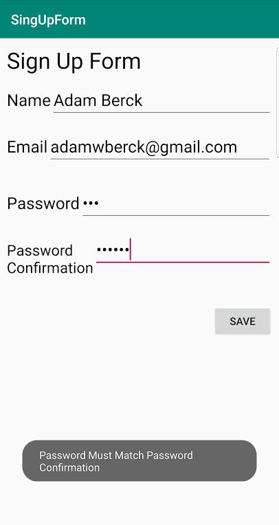

# SingUpForm
This Assignment App has edit texts so the user can enter their name, email, and password.
The app then checks if any field is empty and if the password matches its confirmation. If either fails it displays a specfic toast.
If the info is correct it displays some welcome text.

